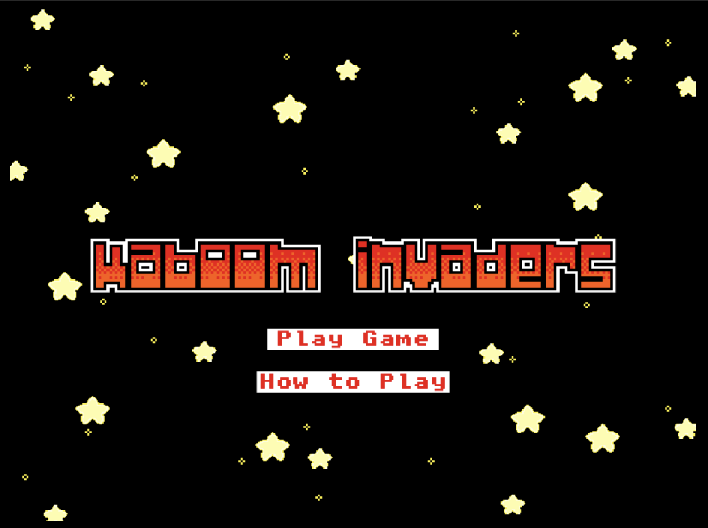
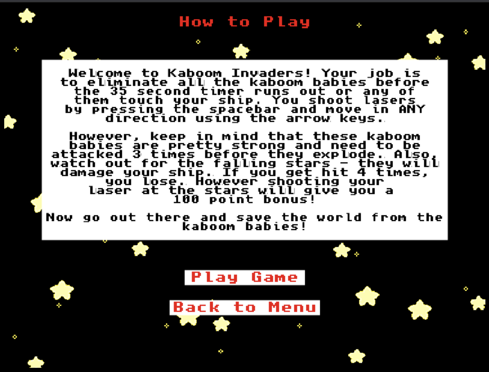
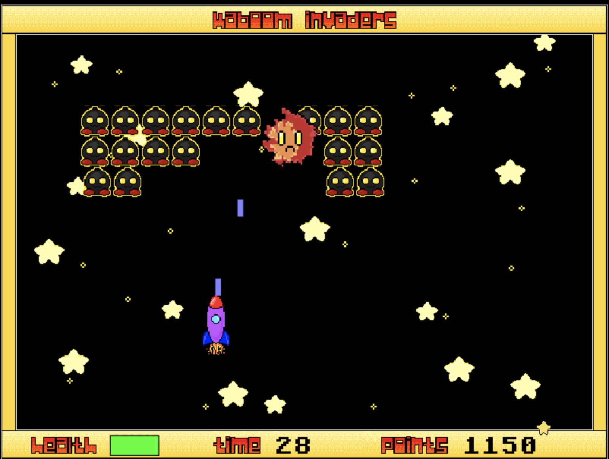

# Kaboom Invaders

## **About the Game**

This is a game I built for a Mintbean hackathon. I used primarily JavaScript and the KaboomJS library to create it. This game is essentially a Space Invaders remake with a few little extras. The graphics were created by myself, but heavily inspired by others' work (I'm not that creative). The sound effects and music were found on freesound.org, with the exception of the explosion sound effect, which was borrowed from a KaboomJS example. A more detailed explanation, including instructions and a demo video, can be found at the [Kaboom Invaders](https://kaboom-invaders.netlify.app/) website.

A direct link to the game can be found [here](https://kaboom-invaders-game.netlify.app/).

## **Screenshots of the Game**

Main Menu

Instructions

Gameplay

## **Deployment Instructions**

1. No need to install any dependencies! Just run with your server of choice, like [http-server](https://github.com/http-party/http-server) or Live Server in VSCode ([repo here](https://github.com/ritwickdey/vscode-live-server))

2. Play!

## **Developed by Amadeusz Sepko**

[GitHub](https://github.com/amad3usz)

[LinkedIn](https://www.linkedin.com/in/amad3usz/)
